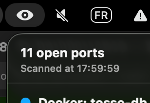
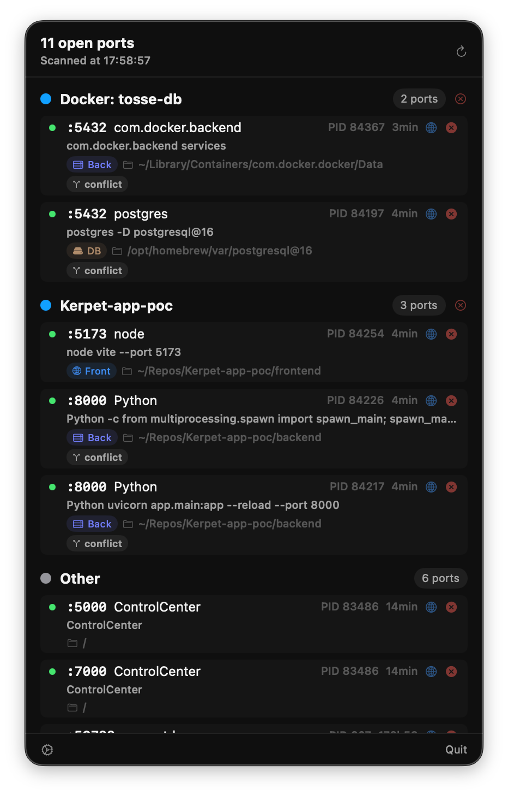
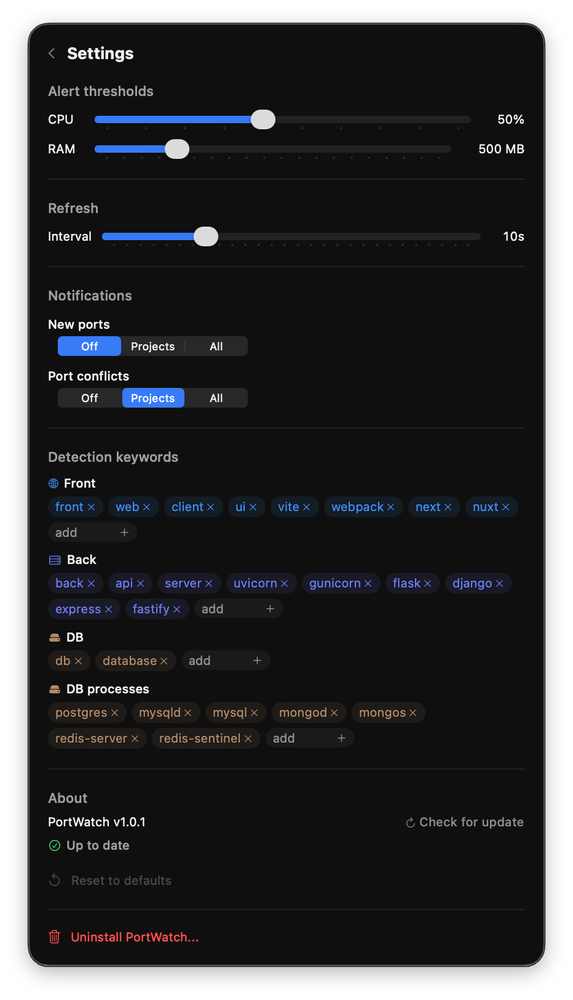

# PortWatch

A lightweight macOS menubar app that monitors open TCP ports in real-time, identifies the associated projects and processes, and lets you manage them without leaving your workflow.







## Features

### Port Detection
- Real-time scanning of all open TCP ports via native macOS APIs (libproc)
- Displays for each port: port number, process name, PID, full command line, uptime
- Automatic refresh every 10 seconds (configurable from 3s to 30s)
- Manual refresh button

### Project Identification
- Automatically groups ports by project using this priority:
  1. **Docker** — matches exposed ports with running containers via `docker ps`
  2. **Git repository** — walks up from the process working directory to find `.git`, uses the repo folder name
  3. **Known ports** — PostgreSQL (5432), MySQL (3306), Redis (6379), MongoDB (27017), Elasticsearch (9200)
  4. **Other** — unidentified processes, shown last

### Role Tagging
Each process is tagged based on configurable keyword matching against the folder name, process name, and command line:

| Tag | Default keywords | Icon |
|---|---|---|
| **Front** | front, web, client, ui, vite, webpack, next, nuxt | Globe |
| **Back** | back, api, server, uvicorn, gunicorn, flask, django, express, fastify | Server rack |
| **DB** | postgres, mysqld, mysql, mongod, redis-server + db, database (folders) | Drive |
| **Cache** | memcached, rabbitmq-server | Bolt |

Keywords are fully editable in Settings.

### Process Management
- **Kill individual process** — SIGTERM with 4s polling, then SIGKILL with 2s polling, with verification at every step
- **Kill entire project** — kills all processes in a group in parallel, with individual verification and detailed report
- **Confirmation required** for "Other" (unidentified) processes to prevent killing system services
- **Open in browser** — opens `http://localhost:PORT` for any port

### Monitoring & Alerts
- **Zombie detection** — processes in CLOSE_WAIT or TIME_WAIT state, flagged with a red badge
- **Port conflict detection** — multiple PIDs listening on the same port, flagged with a yellow badge
- **CPU alert** — orange badge when exceeding threshold (default: 50%, configurable)
- **RAM alert** — orange badge when exceeding threshold (default: 500 MB, configurable)

### Dynamic Menubar Icon
The icon changes based on the number of project ports (excluding "Other"):

| State | Icon |
|---|---|
| No project ports | Eye closed |
| 1-3 ports | Eye open |
| 4-8 ports | Eye filled |
| 9+ ports or zombie detected | Eye with warning |

### Notifications
Optional macOS notifications (via UNUserNotificationCenter), configurable separately:
- **New ports**: Off / Projects only / All
- **Port conflicts**: Off / Projects only / All

### Settings
Inline settings panel with:
- CPU and RAM alert thresholds (sliders)
- Refresh interval (3-30 seconds)
- Notification preferences (segmented controls)
- Detection keywords (editable tags, add/remove)
- Version info with update checker
- Reset to defaults
- Uninstall

### Auto-Update
- Checks GitHub Releases at launch for new versions
- Manual check available in Settings
- One-click update: downloads, replaces, and relaunches automatically

## Installation

### Download
1. Go to the [Releases](https://github.com/Alex375/port-watch/releases) page
2. Download `PortWatch.zip` from the latest release
3. Unzip and move `PortWatch.app` to `/Applications`

### First Launch (unsigned app)
Since the app is not signed with an Apple Developer certificate, macOS will block it the first time:

1. Double-click `PortWatch.app` — macOS shows "cannot be opened"
2. Open **System Settings** > **Privacy & Security**
3. Scroll down — you'll see "PortWatch was blocked"
4. Click **Open Anyway**
5. Reopen `PortWatch.app` — it will launch normally

This is only needed once.

## Uninstall

Two options:
1. **From the app** — Settings > "Uninstall PortWatch..." (with confirmation)
2. **Standalone script** — `./uninstall.sh`

Both remove the .app, UserDefaults preferences, caches, logs, and any residual process.

## Build from Source

Requires Xcode (free, App Store) on macOS 26+.

```bash
# Debug build
xcodebuild -scheme PortWatch -configuration Debug build

# Release build
xcodebuild -scheme PortWatch -configuration Release build

# Run tests (81 tests)
xcodebuild -scheme PortWatch test
```

## Contributing

### Git Workflow

```
feature/xxx ──merge──> dev ──PR──> main ──auto──> GitHub Release
                        |           |
                     CI tests    CI tests + review
```

1. Create a branch from `dev`: `git checkout dev && git checkout -b feature/my-feature`
2. Code, commit, push
3. Merge into `dev` (CI tests must pass)
4. When ready for release: create a PR `dev` -> `main`
5. PR requires CI tests + review from @Alex375
6. On merge to `main`: GitHub Actions automatically builds a Release .app and creates a GitHub Release

### Version Bumping
Update `CFBundleShortVersionString` in `PortWatch/Info.plist` before merging to `main`.

## Stack

| Component | Technology |
|---|---|
| Language | Swift 6.0 |
| UI | SwiftUI MenuBarExtra (.window style) |
| Concurrency | @Observable, @MainActor, Task.detached, TaskGroup |
| Port scanning | Native macOS libproc APIs (import Darwin) |
| Docker detection | docker ps --format json |
| Persistence | UserDefaults |
| Notifications | UNUserNotificationCenter |
| CI/CD | GitHub Actions (macos-26 runner) |
| Min. macOS | 26.0 (Tahoe) |

## License

Personal use.
