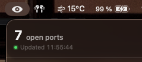
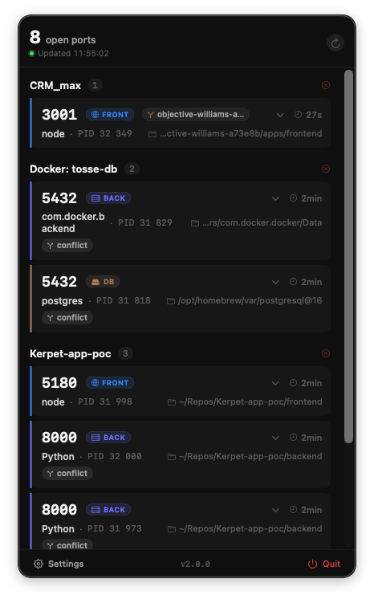
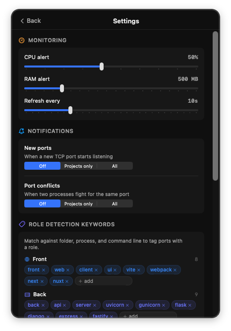
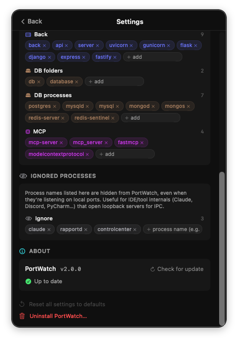

<p align="center">
  
</p>

<h1 align="center">PortWatch</h1>

<p align="center">
  <strong>A lightweight macOS menubar app that monitors open TCP ports, identifies projects & processes, and lets you kill them — without leaving your workflow.</strong>
</p>

<p align="center">
  <a href="https://github.com/Alex375/port-watch/releases/latest"></a>
  <a href="https://github.com/Alex375/port-watch/releases/latest"></a>
  
  
  <a href="https://github.com/Alex375/port-watch/actions"></a>
  <a href="LICENSE"></a>
</p>

<p align="center">
  <a href="#why-portwatch">Why</a> •
  <a href="#features">Features</a> •
  <a href="#installation">Install</a> •
  <a href="#build-from-source">Build</a> •
  <a href="#contributing">Contribute</a>
</p>

---

## Why PortWatch?

Ever run `lsof -i -P | grep LISTEN` to figure out what's hogging port `3000`? PortWatch does it for you — continuously, visually, and with one-click kill.

> **Zero dependencies.** No `lsof`, no Python, no external tools. Native macOS `libproc` APIs only.

<p align="center">
  
  <br />
  <em>PortWatch lives in your menubar — always visible, never in the way.</em>
</p>

- **Project-aware** — groups ports by Docker container, Git repo, or known service
- **Role tagging** — spot your frontend, backend, database, cache or MCP server at a glance
- **Silent by default** — no Dock icon, no popups, just the menubar
- **Fast & native** — Swift 6 + `MenuBarExtra`, strict concurrency, `Sendable` everywhere
- **Verified kills** — `SIGTERM` → poll → `SIGKILL` → confirm dead, with full error reports

---

## Features

### Port Detection

Real-time scanning of all open TCP ports via native macOS APIs (`libproc`).

- Displays **port number · process name · PID · command line · uptime**
- Filters out client-side connection remnants (`CLOSE_WAIT` / `TIME_WAIT` without a matching `LISTEN`)
- Deduplicates dual-stack IPv4/IPv6 listeners
- Auto-refresh every **10s** (configurable: 3s – 30s) with manual refresh button

<p align="center">
  
  <br />
  <em>Ports grouped by project, with role badges, conflict detection, PID, uptime and one-click actions.</em>
</p>

### Smart Project Grouping

Ports are automatically grouped by project using this priority:

| Priority | Method | Example |
|:---:|---|---|
| **1** | **Docker** — matches exposed host ports with running containers (`docker ps`) | `Docker: tosse-db` on `:5432` |
| **2** | **Git root** — walks up from process `cwd` to find `.git` | `CRM_max`, `Kerpet-app-poc` |
| **3** | **Known ports** — PostgreSQL, MySQL, Redis, MongoDB, Elasticsearch | `PostgreSQL` on `:5432` |
| **4** | **Other** — unidentified processes (always shown last) | System services |

### Role Tagging

Each process is tagged with a role based on **configurable keyword matching** against folder name, process name and command line.

| Role | Default keywords |
|---|---|
| **Front** | `front` · `web` · `client` · `ui` · `vite` · `webpack` · `next` · `nuxt` |
| **Back** | `back` · `api` · `server` · `uvicorn` · `gunicorn` · `flask` · `django` · `express` · `fastify` |
| **DB** | `postgres` · `mysqld` · `mysql` · `mongod` · `redis-server` · `redis-sentinel` · `mongos` (+ folders `db`, `database`) |
| **Cache** | `memcached` · `rabbitmq-server` |
| **MCP** | `mcp-server` · `mcp_server` · `fastmcp` · `modelcontextprotocol` |

> All keywords are editable in **Settings → Role detection keywords**.

### Process Management

- **Kill individual process** — `SIGTERM` → 4s polling → `SIGKILL` → 2s polling → verified dead
- **Kill entire project** — kills all processes in a group in parallel with per-process verification and detailed report
- **Safety confirmation** required for *Other* (unidentified) processes
- **Open in browser** — one click to open `http://localhost:PORT`
- **Zero silent errors** — every failure surfaces a `KillReport` with PID, port, process name and system error message

### Monitoring & Alerts

| Indicator | Meaning |
|---|---|
| **Zombie** | `CLOSE_WAIT` sustained across 3 consecutive scans (real socket leak) |
| **Conflict** | Multiple *unrelated* PIDs listening on the same port |
| **Worker fleet** `×N` | Master + workers sharing one listening socket (Python `multiprocessing`, gunicorn, uvicorn, nginx, Node cluster). Collapsed into a single row with aggregated CPU/RAM — not a conflict. |
| **High CPU** | Exceeds threshold (default: 50%) |
| **High RAM** | Exceeds threshold (default: 500 MB) |

### Dynamic Menubar Icon

The menubar icon reflects the state of your system at a glance:

| State | Icon |
|---|---|
| No project ports | Eye closed |
| 1–3 ports | Eye open |
| 4–8 ports | Eye filled |
| 9+ ports **or** zombie detected in a project | Eye with warning |

### Notifications

Optional macOS notifications (off by default), each with three levels:

<kbd>Off</kbd> · <kbd>Projects only</kbd> · <kbd>All</kbd>

- **New ports** — fires when a new TCP port starts listening
- **Port conflicts** — fires when two processes fight for the same port

### Ignored Processes *(new in v2.0)*

Hide process names that open **loopback servers for IPC** but aren't user-facing services — IDE/tool internals like `claude`, `rapportd`, `controlcenter`, `Discord`, `PyCharm`, etc.

Matching is **case-insensitive exact match** on the process name. Configured in **Settings → Ignored processes**.

### Settings

Inline, no separate window. Everything persists to `UserDefaults`.

<p align="center">
  
  &nbsp;
  
</p>

- CPU & RAM alert thresholds (sliders)
- Refresh interval (3–30 seconds)
- Notification preferences (per category, 3 levels)
- Role detection keywords (editable tag chips)
- **Ignored processes** list (editable tag chips)
- Version info + **one-click update checker**
- Reset to defaults / Uninstall

### Auto-Update

Checks the GitHub Releases API at launch. One-click update: downloads the new `.app`, replaces the current one via a helper script, and relaunches.

---

## Installation

### Download

1. Go to [**Releases**](https://github.com/Alex375/port-watch/releases/latest)
2. Download `PortWatch.zip`
3. Unzip and move `PortWatch.app` to `/Applications`

### First Launch (unsigned app)

> The app is **not signed** with an Apple Developer certificate. macOS will block the first launch.

1. Double-click `PortWatch.app` — macOS shows *"cannot be opened"*
2. Open **System Settings → Privacy & Security**
3. Scroll down — you'll see *"PortWatch was blocked"*
4. Click **Open Anyway**

This is only needed once.

---

## Uninstall

| Method | How |
|---|---|
| **From the app** | Settings → *Uninstall PortWatch…* (with confirmation) |
| **Standalone script** | `./uninstall.sh` |

Both remove the `.app`, `UserDefaults` preferences, caches, logs, and any residual process.

---

## Build from Source

> Requires **Xcode** (free from the App Store) on **macOS 26+**.

```bash
# Debug build
xcodebuild -scheme PortWatch -configuration Debug build

# Release build (.app)
xcodebuild -scheme PortWatch -configuration Release build

# Run all tests (81 unit tests)
xcodebuild -scheme PortWatch test

# Run a single test
xcodebuild -scheme PortWatch -only-testing:PortWatchTests/TestClassName/testMethodName test
```

---

## Tech Stack

| Component | Technology |
|---|---|
| Language | **Swift 6.0** (strict concurrency) |
| UI | **SwiftUI** `MenuBarExtra` (`.window` style) |
| Concurrency | `@Observable` · `@MainActor` · `Task.detached` · `TaskGroup` · `Sendable` |
| Port scanning | Native macOS **`libproc`** APIs (`import Darwin`) |
| Docker detection | `docker ps --format json` |
| Persistence | `UserDefaults` |
| Notifications | `UNUserNotificationCenter` |
| CI/CD | **GitHub Actions** (`macos-26` runner) |
| Min. macOS | **26.0** (Tahoe) |

---

## Contributing

### Git Workflow

```
feature/xxx ──merge──▸ dev ──PR──▸ main ──auto──▸ GitHub Release
                        │           │
                     CI tests    CI tests + review @Alex375
```

1. Branch from `dev`: `git checkout dev && git checkout -b feature/my-feature`
2. Code, commit, push
3. Merge into `dev` (CI tests must pass)
4. Open a PR `dev` → `main`
5. PR requires CI + review from @Alex375
6. On merge to `main`: GitHub Actions builds a Release `.app` and publishes a GitHub Release

### Versioning

Version is read from `Info.plist` (`CFBundleShortVersionString`). Bump it before each PR to `main` — otherwise the release is skipped.

| Change type | Version bump | Example |
|---|---|---|
| Bug fix / tweak | Patch | `2.0.0` → `2.0.1` |
| New feature | Minor | `2.0.0` → `2.1.0` |
| Breaking change | Major | `2.0.0` → `3.0.0` |

---

## License

Personal use.
